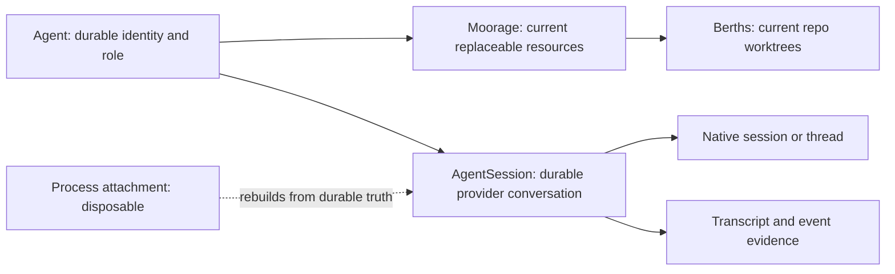

# Agent identity, resources, and recovery

[Design guides](README.md) · [Glossary](../../GLOSSARY.md) ·
[Binding axioms](../../DESIGN.md)

An Agent is a durable responsibility, not a process. Its replaceable resources
and its provider conversation have separate lifecycles because losing one must
not silently destroy the others.

A Piece is work, an Agent is identity, and an AgentSession is execution. Those
relations are not one-to-one: a Piece may assign several Agents, and an Agent
may have several Sessions across handovers or explicit forks. Recovery follows
each durable assignment and Session instead of selecting one row and treating
the rest as finished. A failed provider conversation or resource never makes
the Agent identity irrecoverable or releases its Piece assignment; recovery
resumes the same Session or explicitly links a successor to the same Agent.

## Three truths, three lifecycles

- The **Agent** owns identity, responsibility, and durable addresses such as
  its board. It outlives local processes, worktrees, and provider sessions.
- The Agent has one current **Moorage**. Its folder and Berths may be
  provisioned, reclaimed, and reprovisioned while the Agent persists. This is
  current resource truth, not an event-sourced history of resource
  generations.
- An **AgentSession** owns Antumbra's session identity, the provider-native
  session or thread reference, transcript evidence, and last-known execution
  status. A local SDK handle or observer is only an attachment to that
  durable record.

Agent setup reaches its success boundary when the required Moorage and Berths
are ready. Opening a usable provider Session is subsequent work. A provider,
authentication, or transcript failure after resource readiness must not undo
the Agent or cause the same resources to be provisioned again.

## Demand outlives dispatch

A Piece's human posture is long-lived demand. `start_piece` changes that
posture to desired; reconciliation owns queueing, starting, and resuming. A
desired Piece whose dependencies are unfinished remains desired and blocked
with no dispatch Intent. If a queued Piece becomes blocked or is parked before
starting, its short-lived dispatch Intent is cancelled. A new Intent is
submitted when the durable demand becomes eligible again.

Intent waiting is narrower: an active attempt may wait visibly for immediate
external intervention such as authentication, then retry. Waiting is not a
place to store ordinary Piece prerequisites.

An already assigned Agent and resumable Session are reconciled before another
Agent is spawned. Starting becomes in progress when the first assigned Agent's
Moorage and Session are established and the initial task has been queued to the
provider at least once. It does not wait for marked-read evidence. The default
staffing policy is one Agent, but the model permits several explicit Agent
assignments and does not collapse their Sessions into one execution.

## Durable truth and disposable execution

The database holds everything that remains true after exit: intents, domain
links, Agent and AgentSession identities, native references, transcript and
event evidence, current resource evidence, and last-known execution status.
Memory may hold only execution machinery that is safe to lose: fibers, process
handles, subscriptions, semaphores, timers, wakes, workflow history, and
indexes rebuilt from durable records.

Workflows are never checkpointed. Every attempt starts from its durable intent
and domain state, then reconciles each idempotent step with reality. An
activity's in-memory history may prevent duplicate work within that attempt;
it is not recovery truth.

## Resume before replace

Normal recovery attaches the same AgentSession to the same provider-native
session or thread. Antumbra's neutral event log is the UI and audit surface; it
is not input for reconstructing a provider conversation.

At startup, Sessions whose internal execution status is active, pending, or
uncertain resume by default. Idle Sessions stay detached and attach lazily when
hailed or given work. Those exact statuses are recovery machinery, not product
vocabulary or an ordinary Fleet presentation. Missing observers, an empty
in-memory registry, or a dead watcher only remove current knowledge; they never
mean an Agent retired, a Session closed, a Moorage orphaned, or a claim
released.

Initial and recovery instructions use ordinary at-least-once delivery. After a
successful native attach, recovery durably queues one recovery instruction. If
exit or transport failure obscures whether the provider accepted an
instruction, a retry may send a duplicate; missing it is worse than repeating
an idempotent one. A provider send is not durable evidence that an Agent read
its mail.

If the provider transcript or native session is unavailable, recovery holds
visibly. Starting a linked successor Session is an explicit choice, preserves
the same Agent, and carries a crash-recovery charter plus the available files,
notes, and predecessor link. It is never an automatic substitute for normal
resume.

## Hailing an Agent

Hailing addresses the durable Agent, not a Session id. Antumbra resumes the
Agent's existing internal execution context when one is usable; otherwise it
establishes the context required to converse without replacing the Agent's
identity, responsibility, Board, or assignments. The admiral and other Agents
therefore think in terms of whom they are addressing while Antumbra manages the
execution machinery.

## Shutdown and failure

Graceful shutdown asks active and pending Sessions to settle, drains them to an
idle execution status, and only then exits. A forced shutdown merely ends local
execution. It does not synthesize a mailbox read, Session closure, Agent
retirement, or resource reclamation; startup reconciles the surviving durable
truth.

Authentication requirements, provider uncertainty, and unsafe resource state
are observable holds. Retrying restarts the workflow from durable truth. A
successful intent means its promised durable boundary was reached, not merely
that background work was detached.

Agent-directed mail is durable and board-backed. Addressing and marked-read
state remain true without a Session attachment, and reading never writes a
receipt. In v1 the admiral selects attention and the Agent pulls its mailbox;
no mail arrival or external fact automatically attaches, resumes, or
interrupts a Session.

## Reclamation boundary

Reclamation applies only to replaceable resources. Boards, transcripts, Agent
identity, Session identity, and story are not cleanup targets. Dirty or
unpushed work, unavailable authentication, or uncertain inspection always
blocks automated reclamation. Age can inform which safe resource to reclaim;
it cannot make an unsafe resource safe.

Stand-down is a reversible siesta: it drains toward a safe holding point while
preserving the Agent, its Moorage, and its resumable Sessions. Retirement is
the explicit irreversible end of an Agent and normally drives terminal Moorage
cleanup. Exceptional recovery may instead reclaim a broken or deliberately
abandoned setup for a non-retired Agent; a later ordinary provision attempt
reuses the same Moorage row, reconciles surviving evidence, and recreates only
what is absent. There is no separate resource-reset lifecycle.
