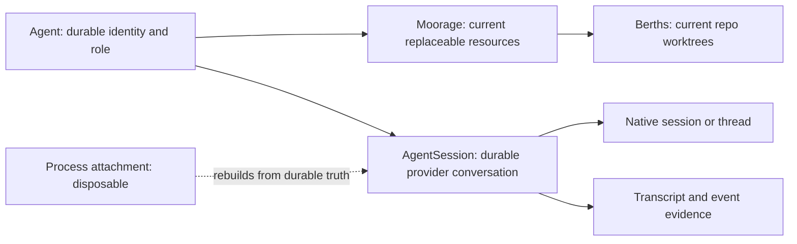

# Agent identity, resources, and recovery

An Agent is a durable responsibility, not a process. Its replaceable resources
and its provider conversation have separate lifecycles because losing one must
not silently destroy the others.

## Three truths, three lifecycles

- The **Agent** owns identity, responsibility, and durable addresses such as
  its board. It outlives local processes, worktrees, and provider sessions.
- The Agent has one current **Moorage**. Its folder and Berths may be
  provisioned, reclaimed, and reprovisioned while the Agent persists. This is
  current resource truth, not an event-sourced history of resource
  generations.
- An **AgentSession** owns Antumbra's session identity, the provider-native
  session or thread reference, transcript evidence, and last-known work
  posture. A local SDK handle or observer is only an attachment to that
  durable record.

Agent setup reaches its success boundary when the required Moorage and Berths
are ready. Opening a usable provider Session is subsequent work. A provider,
authentication, or transcript failure after resource readiness must not undo
the Agent or cause the same resources to be provisioned again.

## Durable truth and disposable execution

The database holds everything that remains true after exit: intents, domain
links, Agent and AgentSession identities, native references, transcript and
event evidence, current resource evidence, and last-known posture. Memory may
hold only execution machinery that is safe to lose: fibers, process handles,
subscriptions, semaphores, timers, wakes, workflow history, and indexes rebuilt
from durable records.

Workflows are never checkpointed. Every attempt starts from its durable intent
and domain state, then reconciles each idempotent step with reality. An
activity's in-memory history may prevent duplicate work within that attempt;
it is not recovery truth.

## Resume before replace

Normal recovery attaches the same AgentSession to the same provider-native
session or thread. Antumbra's neutral event log is the UI and audit surface; it
is not input for reconstructing a provider conversation.

At startup, sessions whose last-known posture is active, pending, or uncertain
resume by default. Idle sessions stay detached and attach lazily when hailed or
given work. Missing observers, an empty in-memory registry, or a dead watcher
only remove current knowledge; they never mean an Agent retired, a Session
closed, a Moorage orphaned, or a claim released.

After a successful native attach, recovery queues one durable recovery
instruction. Delivery is an external effect: Antumbra records the attempt and
marks it delivered only with positive evidence. If exit or transport failure
makes delivery ambiguous, the work holds visibly for a retry decision instead
of silently resending.

If the provider transcript or native session is unavailable, recovery holds
visibly. Starting a linked successor Session is an explicit choice, preserves
the same Agent, and carries a crash-recovery charter plus the available files,
notes, and predecessor link. It is never an automatic substitute for normal
resume.

## Shutdown and failure

Graceful shutdown asks active and pending Sessions to settle, drains them to an
idle posture, and only then exits. A forced shutdown merely ends local
execution. It does not synthesize successful delivery, Session closure, Agent
retirement, or resource reclamation; startup reconciles the surviving durable
truth.

Authentication requirements, provider uncertainty, and unsafe resource state
are observable holds. Retrying restarts the workflow from durable truth. A
successful intent means its promised durable boundary was reached, not merely
that background work was detached.

Agent-directed mail is durable and board-backed. Addressing and delivery are
separate: mail remains true without a Session attachment, and transport into a
running Session follows explicit precedence and delivery evidence.

## Reclamation boundary

Reclamation applies only to replaceable resources. Boards, transcripts, Agent
identity, Session identity, and story are not cleanup targets. Dirty or
unpushed work, unavailable authentication, or uncertain inspection always
blocks automated reclamation. Age can inform which safe resource to reclaim;
it cannot make an unsafe resource safe.
