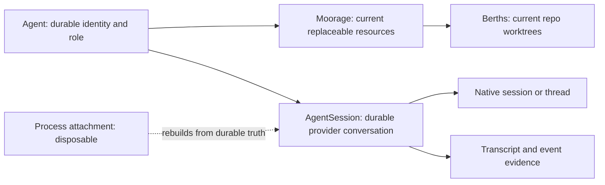

# Agent identity, resources, and recovery

[Design guides](README.md) · [Glossary](../../GLOSSARY.md) · [Binding axioms](../../DESIGN.md)

An Agent is a durable responsibility, not a process. Its replaceable resources and its provider conversation have separate lifecycles because losing
one must not silently destroy the others.

A Piece is work, an Agent is identity, and an AgentSession is execution. Those relations are not one-to-one: a Piece may assign several Agents, and an
Agent may have several Sessions across handovers or explicit forks. Many rows across time is not many at once: an Agent has at most one open root
Session, enforced by a partial unique index rather than by convention. Subsessions are exempt, because a root holds its whole subtree open while it
works. A linked successor therefore requires its predecessor root closed first. Recovery follows each durable assignment and Session instead of
selecting one row and treating the rest as finished. A failed provider conversation or resource never makes the Agent identity irrecoverable or
releases its Piece assignment; recovery resumes the same Session or explicitly links a successor to the same Agent.

## Three truths, three lifecycles

- The **Agent** owns identity, responsibility, and durable addresses such as its board. It outlives local processes, worktrees, and provider sessions.
- The Agent has one current **Moorage**. Its folder and Berths may be provisioned, reclaimed, and reprovisioned while the Agent persists. This is
  current resource truth, not an event-sourced history of resource generations.
- An **AgentSession** owns Antumbra's session identity, the provider-native session or thread reference, transcript evidence, and durable recovery
  evidence. A local SDK handle or observer is only an attachment to that durable record.

Agent setup reaches its success boundary when the required Moorage and Berths are ready. Opening a usable provider Session is subsequent work. A
provider, authentication, or transcript failure after resource readiness must not undo the Agent or cause the same resources to be provisioned again.

## Demand outlives dispatch

A Piece's human posture is long-lived demand. `launch_piece` changes that posture to desired; reconciliation owns queueing, starting, and resuming. A
desired Piece whose dependencies are unfinished remains desired and blocked with no dispatch Intent. If a queued Piece becomes blocked or is parked
before starting, its short-lived dispatch Intent is cancelled. A new Intent is submitted when the durable demand becomes eligible again.

Intent waiting is narrower: an admitted attempt may wait visibly for immediate external intervention such as authentication, then retry. Waiting is
not a place to store ordinary Piece prerequisites.

An already assigned Agent and resumable Session are reconciled before another Agent is spawned. Starting becomes in progress when the first assigned
Agent's Moorage and Session are established and the initial task has been queued to the provider at least once. It does not wait for marked-read
evidence. The default staffing policy is one Agent, but the model permits several explicit Agent assignments and does not collapse their Sessions into
one execution.

## Durable truth and disposable execution

The database holds everything that remains true after exit: intents, domain links, Agent and AgentSession identities, native references, transcript
and event evidence, current resource evidence, and recovery obligations. Memory may hold only execution machinery that is safe to lose: fibers,
process handles, subscriptions, semaphores, timers, wakes, workflow history, and indexes rebuilt from durable records.

Workflows are never checkpointed. Every attempt starts from its durable intent and domain state, then reconciles each idempotent step with reality. An
activity's in-memory history may prevent duplicate work within that attempt; it is not recovery truth.

## Activity, observation, and delivery

Agent activity is a stream of events and load is a level. Quiescence is a derived gauge for observation and policy, not a promise on which a workflow
waits. Provider turns may appear in telemetry, but the domain never treats a turn boundary as conversational completion.

The durable Session event sequence is the UI and audit source. Each observer subscribes to post-write publication before reading the log, then
deduplicates by sequence as live events arrive. That ordering closes the read/subscription gap. Its neutral vocabulary covers opening, messages,
thinking, tool start and completion, usage, rate limits, provider-turn telemetry, subsession opening, ending, and gaps, and raw evidence. A subsession
gap is where the record admits it stopped seeing, and a node's ledger of them is what its completeness is projected from.

A **subsession** is a nested provider conversation a Session spawns through a tool call. It is part of that Session's own record and never an Agent,
but it is durable in its own right: a Session row with its own id, its parent and root edges, the kind and label it opened under, an outcome, a
completeness, and its own journal. A provider child driven again reopens the row it already has rather than minting a duplicate. Every event names the
node that produced it, so one Session reads as a tree whose root is the Session itself, and the opening events carry the tree's edges. A node can be
read on its own — the renderer opens a node's feed — while only the root is resumed, sent to, or stopped. Delegated work stays the Session's work, but
the log says who actually did it.

The transcript accumulates messages, pairs tool lifecycle events, and renders usage and turn events as visual rhythm rather than domain boundaries.
Unknown kinds and provider payloads remain visible as raw evidence instead of taking the projection down. A renderer may invoke only acts already
owned by the domain, such as spawn, retire, or interrupt. It cannot invent a reply path or another delivery model.

Every backend implements two delivery acts. `steer` enters work already under way; `queue` waits for the provider's next full boundary. Precedence
policy in the domain chooses the act. A backend cannot silently omit one, choose for the caller, or make its native session identifier authoritative.

Delivery is not all a backend owes. Every backend also answers an **audit**, which reads and never attaches: a **census** asks what work a root
spawned that the stream never carried, and a node audit asks what the provider still holds about one node. Both answer in the same neutral events a
live frame produces, so a finding travels the one journal path the record already has instead of a second writer of its own. Neither may fail — a
provider that cannot be asked is itself a fact about the record, and the lane says so with a gap rather than by failing. A backend with no second
surface to read answers both with nothing.

## Resume before replace

Normal recovery attaches the same AgentSession to the same provider-native session or thread. The resumable unit is the root Session. A subsession has
no attachment of its own, and resuming one would re-enter a conversation its root is still holding, so recovery, drain, and stop all address roots and
let the subtree settle underneath. Antumbra's neutral event log is the UI and audit surface; it is not input for reconstructing a provider
conversation.

Nothing resumes a Session on its own. Startup reconciles the durable rows and stops there: every Session comes back detached, and one whose row still
says it was executing is **stranded** rather than repaired. No timer, sweep, projection, or boot pass ever opens a provider conversation to find out
how a Session is doing. A wake is submitted by a hail, by a send, or by the dispatcher handing a Session a Piece already assigned to it — three
explicit acts, each one asked for by somebody.

Missing observers, an empty in-memory registry, or a dead watcher only remove current knowledge; they never mean an Agent retired, a Session closed, a
Moorage orphaned, or a claim released.

Initial and wake instructions use ordinary at-least-once delivery. After a successful native attach, the wake durably queues one instruction. If exit
or transport failure obscures whether the provider accepted an instruction, a retry may send a duplicate; missing it is worse than repeating an
idempotent one. A provider send is not durable evidence that an Agent read its mail.

If the provider transcript or native session is unavailable, the wake holds visibly and says on its own row why. Nothing pushes it again; the admiral
does. Starting a linked successor Session is an explicit choice, preserves the same Agent, and carries a crash-recovery charter plus the available
files, notes, and predecessor link. It is never an automatic substitute for normal resume.

## Hailing an Agent

Hailing addresses the durable Agent, not a Session id. Antumbra resumes the Agent's existing internal execution context when one is usable; otherwise
it establishes the context required to converse without replacing the Agent's identity, responsibility, Board, or assignments. The admiral and other
Agents therefore think in terms of whom they are addressing while Antumbra manages the execution machinery.

## Shutdown and failure

Graceful shutdown asks attached executive work to settle at a safe boundary and only then exits. A forced shutdown merely ends local execution. It
does not synthesize a mailbox read, Session closure, Agent retirement, or resource reclamation; startup reconciles the surviving durable truth.

Authentication requirements, ambiguous provider acceptance, and unsafe resource state are observable holds. Retrying restarts the workflow from
durable truth. A successful intent means its promised durable boundary was reached, not merely that background work was detached.

Agent-directed mail is durable and board-backed. Addressing and marked-read state remain true without a Session attachment, and reading never writes a
receipt. In v1 the admiral selects attention and the Agent pulls its mailbox; no mail arrival or external fact automatically attaches, resumes, or
interrupts a Session. Speaking to a Session is not such a fact. It is the admiral's own intent, and intent is exactly what a wake is for — so a send,
and nothing else, may resume an asleep Session. No notification, projection, timer, or background reconciliation ever does.

## Provisioning and resource topology

Repositories are registered once at the app level. Each registration owns a bare mirror under app-managed data; before a provider Session opens, the
runner provisions one Berth from each mirror into the Agent's current Moorage on a `work/…` branch. The registry names every repository, and a
registration whose name would claim the Berth folder another registered repository answers to is refused, so two Berths never share a folder or a
branch. The Moorage folder is the Agent's current working directory and scratchpad, and every Berth is a folder directly inside it. With no
repositories registered, the Agent still receives a bare scratch Moorage. Narrowing repository visibility may later filter what an Agent sees, but it
never binds repositories to a Piece or Voyage.

The same Moorage row survives physical loss and later reprovisioning. Ordinary provisioning reconciles that durable row with whatever folders and
Berths remain, creating only what is absent. Dirty or unpushed work, unavailable authentication, or ambiguous inspection blocks automated reclaim.
Declared gitignored paths are disposable and therefore do not strand otherwise safe resources. Age may rank safe candidates but never proves safety.

Runners register through the same plugin surface as backends and report their capabilities honestly. In particular, the local runner cannot claim
terminal support until Antumbra can actually render and operate a terminal.

## Rest and reaping

A root Session is in one of five states, and only the last of them refuses to be spoken to.

- **Working** — taking a turn. Words queue and arrive at the next provider boundary.
- **Idle** — the Agent has said it has nothing left to do. The provider Session stays open and listening and no tokens are spent holding it. Words
  arrive immediately, because there is nothing to wake.
- **Asleep** — the process attachment was given up on purpose, from a Session that had nothing left to do. The Session row is open and resumable, and
  words wake it: Antumbra resumes it through the same machinery a hail uses and delivers them on arrival.
- **Stranded** — the process attachment is gone and the row still says the Session was executing, so the work it was doing never finished. Nothing
  goes and fetches it back. It is shown as stranded so the admiral can see it happened and hail it, and the moment its stream ended is written to the
  log.
- **Retired** — the identity has ended. This is the only state that refuses.

The two quiet states are reached by different things, and which thing matters. Standing down is a declaration, not a request to be put away: it drains
work toward a safe holding point and leaves the Agent idle, attached, and reachable. Siesta is reached from outside the Agent instead — by the clock
when a Session has been idle longer than the threshold, or by the admiral asking for it now — never by the Agent, which cannot ask to be reclaimed and
cannot refuse to be. Both askers reach it through the same act and meet the same guard inside it, so there is one way a Session is put to rest and one
way it wakes. Idleness is therefore true only of a live process: a restart necessarily leaves every idle Session asleep, which is what the record
already said, so boot has nothing to repair and reads them as ordinary resumable Sessions rather than as failures.

A Session that was working when its process went is the other case, and it is not rest at all. Its turn ends with nobody listening, so the ending
settles the row the way any ending does — an ending nothing is holding is nobody's to refuse — and the Session reads asleep from then on. Where no
ending ever arrives, the row keeps saying it was executing and the Session reads stranded until it is hailed.

A root Session is reapable only after its provider work, tool calls, subsession subtree, descendant Agent tree, and background obligations have all
settled; an open subsession means the record is still unaccounted for, and resource pressure never interrupts an in-flight subtree. Long-lived
concerns are externalized as subscriptions, open [rulings](rulings.md), and Board-backed mail rather than keeping a process attachment alive.

Whether the subtree has settled is asked of the acquisition, not of the rows. Only a root is ever attached and every node under it rides that one
stream, so a node the live stream opened and has not seen end is work reclaiming would cut off mid-sentence — while a node row left open by a stream
that is already gone says only that the record never learned how it ended, which no amount of waiting will now change. Rest is therefore offered and
performed only while nothing the current acquisition started is still speaking, and a request that arrives a moment too late is refused by name rather
than quietly granted. Retirement answers to a weaker rule on purpose: it is withheld only while a Session is mid-turn, because ending an Agent is also
what finally closes a subtree nothing else can settle.

When pressure requires eviction, policy chooses among safe root Sessions by which is least likely to wake soon. The durable Agent, Session identity,
Board, mailbox, and recovery evidence remain, so losing the process attachment never becomes loss of work or identity.

## Reclamation boundary

Reclamation applies only to replaceable resources. Boards, transcripts, Agent identity, Session identity, and story are not cleanup targets. The
evidence boundary and selection policy above govern every automated reclamation.

Stand-down leaves an Agent idle and reachable; siesta is the reversible rest a long-idle Session is later put into. Both preserve the Agent, its
Moorage, and its resumable root Sessions, and either can be left by speaking to the Session. Retirement is the explicit irreversible end of an Agent
and normally drives terminal Moorage cleanup. Exceptional recovery may instead reclaim a broken or deliberately abandoned setup for a non-retired
Agent; a later ordinary provision attempt reuses the same Moorage row, reconciles surviving evidence, and recreates only what is absent. There is no
separate resource-reset lifecycle.
